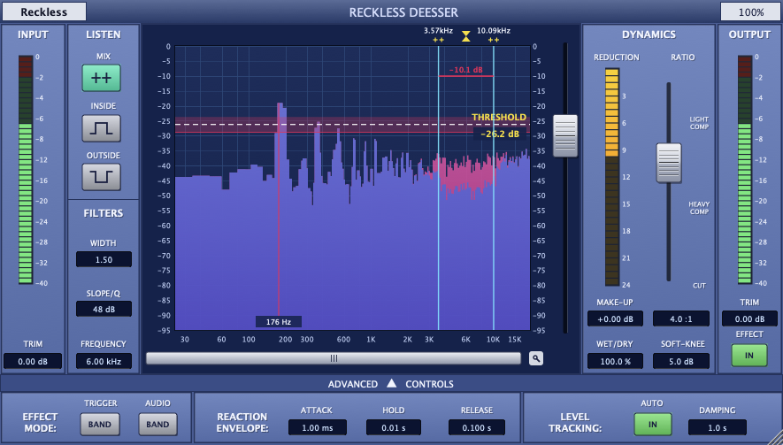

# Reckless DeEsser

De-esser à phase linéaire avec seuil flottant, au format **VST3** et **AU** (macOS) et **VST3** (Windows).
L'interface se **redimensionne librement** (de 50 % à 250 %).



> Projet indépendant, inspiré du fonctionnement d'un de-esser professionnel bien connu.
> Il n'est ni affilié, ni approuvé par Sonnox Ltd. « Oxford » et « SuprEsser » sont des marques de leurs propriétaires.

## Fonctionnalités

| Section | Contrôles |
|---|---|
| **Input / Output** | Trim d'entrée et de sortie (±24 dB), vumètres crête, bouton **Effect** IN/OUT (bypass compensé en latence) |
| **Listen** | **Mix** (sortie normale), **Inside** (contenu de la bande seul), **Outside** (tout sauf la bande) |
| **Filters** | **Frequency** (1 à 16 kHz), **Width** (0,1 à 5 octaves), **Slope** (6 à 96 dB/oct) |
| **Affichage** | Spectre FFT d'entrée (magenta) et de sortie (bleu), bornes de bande et centre déplaçables à la souris, seuil flottant déplaçable, zone de knee, fréquence crête, valeur de réduction, zoom et défilement de l'axe des fréquences |
| **Dynamics** | Threshold (fader), **Ratio** (1:1 jusqu'à **CUT**), Make-Up, Wet/Dry, Soft-Knee, mètre de réduction |
| **Advanced** | **Trigger** Band/Wide (source de détection), **Audio** Band/Wide (atténuation de la bande seule ou de tout le signal), **Attack / Hold / Release**, **Level Tracking** Auto + **Damping** |

### Traitement

- **Séparation à phase linéaire** : un FIR passe-bande symétrique (fenêtre de Kaiser) extrait la bande « inside ».
  La partie « outside » vaut *signal retardé − inside*, donc *inside + outside = entrée* au bit près.
  Les changements de bande sont fondus enchaînés (pas de clic).
- **Latence < 2 ms** quelle que soit la fréquence d'échantillonnage (environ 1,95 ms), déclarée à l'hôte.
- **Seuil flottant** (Level Tracking) : le seuil suit le niveau RMS moyen du programme
  (constante de temps = *Damping*, référence −20 dBFS). Un passage doux est donc traité comme un passage fort.
- Détecteur crête lié en stéréo, avec attack, hold et release, plus une courbe à ratio et soft-knee.
- Mono et stéréo.

### Taille de l'interface

- Glisse le coin inférieur droit (le ratio d'aspect est conservé), **ou**
- clique sur l'indicateur `100%` en haut à droite et choisis une taille de 50 à 250 %.
- La taille et l'ouverture du panneau *Advanced* sont enregistrées avec la session.

Raccourcis : **double-clic** sur une valeur ou un fader pour revenir à la valeur par défaut, **glisser verticalement**
sur une valeur pour la modifier, **molette** sur le spectre pour changer la largeur de bande.

## Installation

Télécharge l'archive de ta plateforme depuis les [Releases](../../releases) ou depuis les artefacts de la
[CI](../../actions), puis copie :

| Format | macOS | Windows |
|---|---|---|
| VST3 | `~/Library/Audio/Plug-Ins/VST3/` | `C:\Program Files\Common Files\VST3\` |
| AU | `~/Library/Audio/Plug-Ins/Components/` | — |

Les binaires macOS ne sont pas notarisés. Si macOS bloque le plugin, lance :

```bash
xattr -dr com.apple.quarantine ~/Library/Audio/Plug-Ins/Components/"Reckless DeEsser.component" ~/Library/Audio/Plug-Ins/VST3/"Reckless DeEsser.vst3"
```

## Compiler

Prérequis : CMake ≥ 3.22 et un compilateur C++20 (Xcode ou Command Line Tools sur macOS, Visual Studio 2022 sur Windows).
JUCE 8 est téléchargé automatiquement.

```bash
cmake -S . -B build -DCMAKE_BUILD_TYPE=Release
cmake --build build --config Release
ctest --test-dir build -C Release --output-on-failure
```

Options :

- `-DRDE_COPY_PLUGIN=ON` : installe les plugins dans les dossiers utilisateur après la compilation.
- `-DCMAKE_OSX_ARCHITECTURES="arm64;x86_64"` : binaire universel macOS.
- `-DRDE_BUILD_TOOLS=ON` : outil `RecklessDeEsserSnapshot`, qui génère les captures de `docs/`.

## Structure

```
Source/
  dsp/BandSplitter.h      FIR à phase linéaire (conception + filtrage + crossfade)
  dsp/DeEsserEngine.h     détection, seuil flottant, courbe de gain, modes d'écoute, mix
  dsp/AnalyserFifo.h      FIFO lock-free audio -> interface
  Parameters.*            paramètres (APVTS) et lecture temps réel
  PluginProcessor.*       processeur JUCE, état, mètres
  PluginEditor.*          mise en page et redimensionnement
  ui/                     widgets, analyseur FFT, affichage spectral
tests/DspTests.cpp        tests unitaires du moteur
tools/Snapshot.cpp        rendu hors écran de l'interface
```

## Licence

[GNU AGPL v3](LICENSE). Le projet est construit avec [JUCE](https://juce.com) sous licence AGPLv3.
